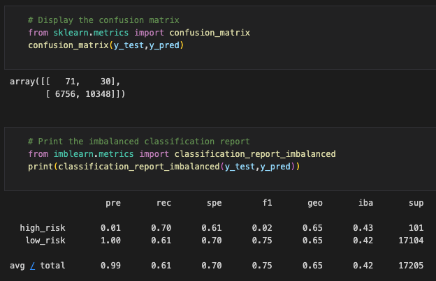
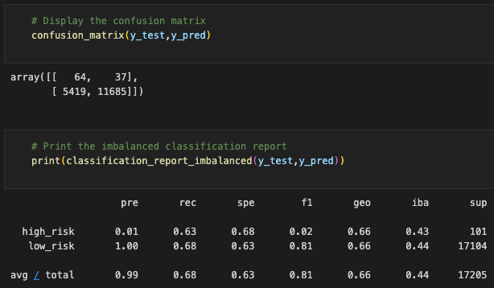
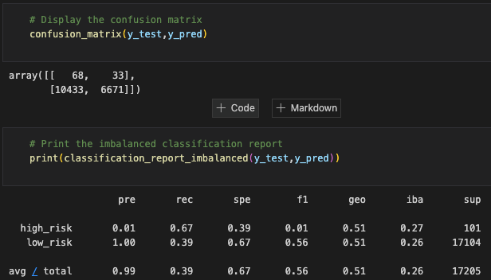
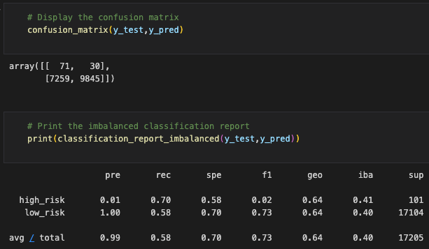
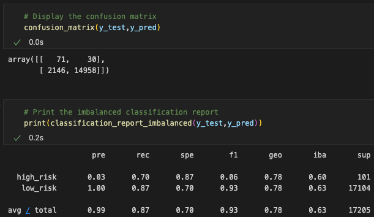
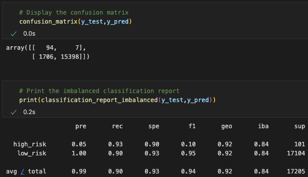

# Credit_Risk_Analysis
## Purpose
In this analysis, various supervised machine learning models will be built and used to determine whether or not to accept risky loans. As the data set is unbalanced - that is, the risky loans are far less likely to occur than good loans - various over- and undersampling methods will be used and evaluated for the best model.

## Results
- `RandomOverSampler`
    - Balanced Accurary Score: 0.654
    
    Other results
    
- `SMOTE`
    - Balanced Accuracy Score: 0.658
    
    Other Results
    
- `ClusterCentroids`
    - Balanced Accuracy Score: 0.532
    
    Other Results
    
- `SMOTEEN`
    - Balanced Accuracy Score: 0.639
    
    Other Results
    
- `BalancedRandomForestClassifier`
    - Balanced Accuracy Score: 0.78
    
    Other Results
    
- `EasyEnsembleClassifier`
    - Balanced Accuracy Score: 0.915

    Other Results
    

## Summary
The order in which one should use each of these models from worst to best is the following:

1. Cluster Centroids
2. SMOTEEN
3. Random OverSampler
4. SMOTE
5. Balanced Random Forest Classifier
6. Easy Ensemble Classifier.

The Easy Ensemble Classifer has a precision of 0.90, a recall of 0.93, and an F1 of 0.95. Each of these scores is better than in any other model.